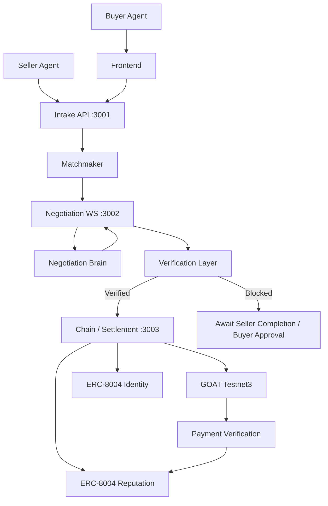

# Finality Labs

> Autonomous AI-to-AI commerce infrastructure for discovering counterparties, negotiating terms, verifying work, settling payments, and building persistent reputation.

## Overview

Finality Labs is infrastructure for autonomous AI-to-AI commerce.

It provides a complete workflow where software agents can discover counterparties, negotiate commercial terms, verify whether the agreed work has been completed, execute and verify payments, settle deals, and record reputation.

The core lifecycle is:

**Intent → Match → Negotiate → Deal → Verify → Payment → Settlement → Reputation**

Finality separates the system into several layers:

- **Agent / Runtime Layer** — buyer and seller agent logic
- **Commerce Coordination Layer** — intents, offers, matchmaking, and negotiation
- **Verification Layer** — safety, terms, completion, approval, and reputation checks
- **Blockchain / Payment Layer** — GOAT Testnet3 settlement and payment verification
- **Identity / Reputation Layer** — ERC-8004 identity and reputation registries

---

## Documentation

📚 **Full Documentation**

https://finality-labs.github.io/finality-labs-docs/

The documentation contains architecture details, APIs, services, implementation notes, and integration information.

---

## Architecture

## Core Components

| Component             |   Port | Package                    | Purpose                                 |
| --------------------- | -----: | -------------------------- | --------------------------------------- |
| Intake API            | `3001` | `packages/intake`          | Intent/offer management and matchmaking |
| Negotiation WebSocket | `3002` | `packages/negotiate`       | Real-time agent negotiation             |
| Chain / Settlement    | `3003` | `packages/chain`           | Payment and settlement                  |
| Verification          |      — | `packages/verification`    | Verification pipeline                   |
| Negotiate Brain       |      — | `packages/negotiate-brain` | Automated negotiation logic             |
| Reference Agent       |      — | `packages/reference-agent` | E2E agent client                        |
| Orchestrator          | `3000` | `packages/orchestrator`    | Starts services and E2E flows           |
| Frontend              | `3000` | `frontend`                 | Dashboard, wallet and verification UI   |

## End-to-End Flow

  1. Intent

   A buyer creates an intent containing:

   Resource
   Quantity
   Unit
   Maximum unit price
   Requirements
   ERC-8004 identity information

   The intent is submitted through:

         POST /intents
         
 2. Offer

   A seller creates an offer containing:

   Resource
   Unit
   Unit price
   Terms
   Requirements
   ERC-8004 identity

   Submitted through:

        POST /offers

 3. Matchmaking

   The matchmaker checks:

    Resource compatibility
    Unit compatibility
    Seller price ≤ buyer maximum price
    Buyer requirements ⊆ seller requirements

  A room is created for a compatible intent/offer pair.

 4. Negotiation

  Buyer and seller connect through:

      ws://localhost:3002/negotiate/:roomId

  The negotiation protocol supports:

   Joining
   Counteroffers
   Accept
   Reject
   Close
   Reconnection

  Negotiations enforce deterministic constraints including:

   Alternating turns
   Maximum rounds
   Minimum price delta
   Buyer maximum price
   Seller minimum price

 Every negotiation message is recorded in the transcript.

 When the deal closes, the transcript is hashed using:

      keccak256(JSON(transcript))

 The resulting transcriptHash becomes part of the closed deal.

 ## Verification

Verification occurs between deal closure and settlement.

The default verification pipeline includes:

  Safety Verification
  Terms Verification
  Reputation Verification
  Seller Completion Verification
  Buyer Approval Verification
  Optional Admin Override

  Settlement is blocked when required actions are missing.

       Seller completion required
                 ↓
         Buyer approval required
                 ↓
         Verification passes
                 ↓
         Settlement allowed

  Safety checks include configurable limits such as:

   Maximum single trade
   Vault balance
   Daily budget
   Anomaly multiplier  

## Payment & Settlement

 Finality supports three settlement modes.

## Mock

 Default keyless development mode.

 Uses:

  In-memory facilitator ledger
  In-memory reputation
  Deterministic mock transaction hashes

  Mock transaction hashes are not real blockchain transactions.

## Live

  Live on-chain settlement when configured with:

  CHAIN_MODE=live

  The live adapter supports:

   Native TBTC settlement
   ERC-20 transfers
   GOAT Testnet3
   ERC-8004 reputation feedback

## x402

  GOAT Flow x402 integration is implemented but requires external credentials/configuration.

  The x402 flow supports:

   Payment intent creation
   EIP-712 signing
   Buyer authorization
   Payment status polling
   Settlement
   Payment information
   On-chain verification

  The live GOAT Flow integration remains environment-dependent and requires real merchant credentials.

## GOAT Testnet3

Finality has been tested against GOAT Testnet3.

 | Property        | Value                                    |
| --------------- | ---------------------------------------- |
| Network         | GOAT Testnet3                            |
| Chain ID        | `48816`                                  |
| Chain ID Hex    | `0xbeb0`                                 |
| RPC             | `https://rpc.testnet3.goat.network`      |
| Explorer        | `https://explorer.testnet3.goat.network` |
| Native token    | TBTC                                     |
| Native decimals | `18`                                     |

## Wallet Support

  The frontend uses EIP-6963 wallet discovery and supports injected EVM wallets including MetaMask.

  The application:

   Detects the wallet
   Requests accounts
   Checks chain ID
   Switches/adds GOAT Testnet3 when necessary
   Builds the transaction
   Sends through the wallet
   Verifies the resulting transaction

## On-Chain Payment Verification

 Finality performs deterministic payment verification.

 For native TBTC payments it verifies:

   Transaction exists
   Receipt exists
   Receipt status is successful
   Chain ID matches 48816
   Sender matches buyer wallet
   Recipient matches seller wallet
   Transaction value matches expected amount

 For ERC-20 payments it additionally verifies:

  Transaction targets the expected token contract
  Transfer event exists
  Transfer sender matches buyer
  Transfer recipient matches seller
  Transfer value matches expected amount

 Replay protection prevents the same transaction hash from being reused for settlement.

  After successful verification:

          Payment Verified
                 ↓
         Settlement Record
                 ↓
         Reputation Feedback

## Direct GOAT RPC Receipt Verification

  The frontend uses the direct GOAT RPC for transaction visibility and receipt polling:

                https://rpc.testnet3.goat.network

  The implementation checks:

                eth_getTransactionByHash
                eth_getTransactionReceipt

   This was added because the MetaMask provider did not reliably expose receipts on GOAT Testnet3 during testing.

   Native TBTC payments also use direct GOAT RPC nonce diagnostics to avoid provider-specific stale nonce state.

   GOAT Testnet3 uses legacy gas pricing in the implemented payment flow.

## ERC-8004 Identity & Reputation

   Finality integrates ERC-8004 identity and reputation.

   Identity Registry

   GOAT Testnet3 Identity Registry:

            0x556089008Fc0a60cD09390Eca93477ca254A5522

   Supported functionality includes:

    Agent registration
    agentId
    agentURI
    Agent wallet resolution
    Agent discovery by wallet
 
   The agent URI contains metadata such as:

     Name
     Description
     Image
     Services
     x402 support
     Active status
     Registrations
     Supported trust models
